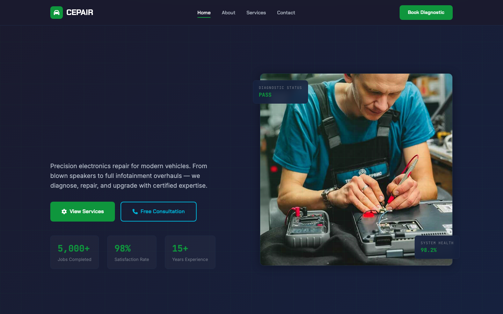

# CEPAIR — Car Electronics Repair HTML Template

A premium, framework-free HTML/CSS/vanilla-JS template for car audio, diagnostics, and smart-upgrade specialists. Built bespoke from the subject — not a recolored scaffold.

**Live preview:** `index.html` (open in browser)
**Stack:** HTML5 · CSS3 (custom properties, Grid, Flex) · Vanilla JS (no build step)
**Fonts:** Chakra Petch (display) · Inter (body) · JetBrains Mono (labels/data) — all via Google Fonts
**License:** MIT — use commercially, modify freely.

---

## 📸 Screenshot



## Pages

| Page | Description | Link |
|------|-------------|------|
| **Home** | Animated scan-line hero with diagnostic status badges and floating readout panels, 6 service cards with image overlays, about-band with dual images + check grid, 4-step diagnostic process, 3 testimonials, split contact CTA with form + info cards | [index.html](index.html) |
| **About** | Page hero with breadcrumb, company story split (dual images + narrative), 6 advantage feature cards with icons, 4-member team grid with role badges, CTA band | [about.html](about.html) |
| **Services** | Page hero, 6 detailed service modules (Audio Install, Diagnostics, Infotainment, Wiring, Cameras, Security) each with image, service-code badge, description, and spec tags, 4-step process band, CTA | [services.html](services.html) |
| **Contact** | Page hero, split layout with contact info cards (phone, email, workshop, hours) + full quote form with service dropdown and vehicle field, embedded Google Map | [contact.html](contact.html) |

---

## Design Distinction

**This template was authored fresh for a car-electronics subject and diverges from every sibling template on all 6 divergence axes:**

| Axis | CEPAIR (this template) | Sibling templates (AERION, CONSTRA, VOSSEN, etc.) |
|------|----------------------|---------------------------------------------------|
| **Hero composition** | Diagnostic-screen aesthetic: dark navy background with green grid overlay, animated scan-line sweeping vertically, floating readout panels ("Diagnostic Status: PASS", "System Health: 98.2%"), stat cells in bordered boxes. Hero reads like a live vehicle diagnostic interface. | AERION: thermostat gauge dial. CONSTRA: full-viewport carousel with vertical sidebar. VOSSEN: split headline + image. Others: centered hero + buttons. |
| **Layout grammar** | Diagnostic-panel grammar: `.hero` (scan-line + grid + readouts) → `.services-grid` (image cards with overlay tags) → `.about-band` (dual-image split) → `.process-steps` (4 numbered cards with connecting lines) → `.testimonials` → `.contact-cta` (split form + info). Content reads like a diagnostic workflow — intake, scan, report, repair. | AERION: status bar → gauge panel → readouts → service grid. CONSTRA: carousel → timeline → mosaic → blog grid. Others: standard section-stack. |
| **Typography personality** | **Chakra Petch** (display, tech-angular with Thai/Latin geometric character) + **Inter** (body, neutral clarity) + **JetBrains Mono** (service codes, status readouts, monospace labels). Technical diagnostic voice — precise, monospace-heavy, system-oriented. | AERION: Barlow Condensed (industrial). CONSTRA: DM Serif Display (editorial serif). Others: Space Grotesk, DM Sans, Jost. |
| **Color logic** | Diagnostic-screen palette: charcoal (`--charcoal`), deep navy (`--navy`), electric green (`--green`) for status-pass, cyan (`--blue`) for data, subtle border-glow effects. Green = operational, blue = information, navy = system background. Derived from diagnostic UI conventions, not brand ramp. | AERION: cool blue + warm orange + frost. CONSTRA: terracotta + earth + stone. Others: primary brand ramp + neutral. |
| **Motion signature** | Scan-line sweep (`.hero__scanline` — infinite vertical line), pulse-dot (`.pulse-dot` on status badges), clip-path reveal (`.reveal` — wipe from right), staggered fade-up on grids. Motion reads like system diagnostics — scan means active, pulse means online, wipe means booting. | AERION: gauge needle tick, fan pulse. CONSTRA: slide-up reveals, carousel fade, counter count-up. Others: generic opacity fade. |
| **Section inventory** | Navbar (blurred glass) → Hero (grid + scan-line + readouts + floating panels) → Service grid (6 cards) → About band (dual images) → Process steps (4 with connectors) → Testimonials (3 cards) → Contact CTA (split form + info) → Footer (4-col with hours). | AERION: Status bar → Gauge → Readouts → Service grid → Emergency band → Pricing. CONSTRA: Carousel → Counter → Timeline → Mosaic → Blog → CTA banner. |

**Bottom line:** Strip the colors from CEPAIR and any sibling — they share **zero** layout grammar, component set, or motion vocabulary. This reads as a vehicle diagnostic system interface, not a generic service site.

---

## Features

- **Scan-line hero** — animated vertical scan line over grid background with floating diagnostic panels
- **Diagnostic status badge** — "System Online" with animated green pulse dot
- **Service cards** — 6 modules with image overlays, hover scale, and "Popular" tag support
- **About-band** — dual-image mosaic with narrative, 6-item check grid, and CTA box
- **Process steps** — 4-column numbered cards with connecting line accents and hover glow
- **Testimonials** — 3-column cards with star ratings and avatar initials
- **Contact form** — service dropdown + vehicle field + message, inline validation, success toast
- **Contact info cards** — phone, email, workshop address, business hours
- **Embedded map** — Google Maps iframe on contact page
- **Scroll reveals** — IntersectionObserver with clip-path wipe (`.reveal`) and fade-up animations
- **Staggered children** — `.stagger` container delays child animations sequentially
- **Navbar** — fixed with backdrop blur, scroll-state background, active link indicator, burger menu
- **Back-to-top** — fixed button appears on scroll with green glow shadow
- **Footer year** — `#current-year` auto-fills current year
- **Reduced motion** — CSS respects `prefers-reduced-motion` for scan-line and reveal animations
- **Responsive** — 3 breakpoints (991px, 767px): stacked grids, hidden hero visual, mobile nav drawer
- **Original imagery** — 11 source images from the original template (about, carousel, feature, service-1 through service-6)

---

## Quick Start

```bash
# No install, no build — just open
open index.html
# or serve locally
npx serve .
```

---

## File Structure

```
car-electronics-repair-html-template/
├── index.html          # Home page
├── about.html          # About / Team
├── services.html       # Services detail
├── contact.html        # Contact / Get a Quote
├── assets/
│   ├── css/
│   │   └── base.css    # Bespoke design system (~770 lines)
│   ├── js/
│   │   └── main.js     # Burger nav, scroll observer, form handling (~83 lines)
│   └── img/            # 11 original source images
└── README.md           # This file
```

---

## Customization

- **Colors:** Edit `:root` tokens in `assets/css/base.css` — `--green` (status-pass), `--blue` (data), `--charcoal`, `--navy` (backgrounds)
- **Fonts:** Swap Google Fonts `<link>` in each HTML `<head>` and update `--font-display/--font-body/--font-mono`
- **Services:** Add/remove `.service-card` items in the `.services-grid` on each page; update service codes (SVC-001 etc.)
- **Process steps:** Edit `.process-step` cards — step numbers, titles, descriptions
- **Contact info:** Update phone, email, address, and hours in the `.contact-info-card` elements
- **Scan-line speed:** Adjust the `animation: scanline` duration in `.hero__scanline`
- **Testimonials:** Edit `.testimonial` cards — stars, text, avatar initials, names, roles

---

## Browser Support

Modern evergreen browsers (Chrome 90+, Firefox 88+, Safari 14+, Edge 90+).
Graceful degradation: CSS custom properties, Grid, Flex, `clamp()`, `IntersectionObserver` — all polyfillable if needed.

---

## Credits

- **Images:** Original source assets (included in `assets/img/`)
- **Fonts:** Chakra Petch (Ittapun Chonlasri), Inter (Rasmus Andersson), JetBrains Mono (JetBrains) — all SIL OFL via Google Fonts
- **Icons:** Font Awesome 6.5.1 (CDN) — used for navbar, service icons, contact icons, social links

---

Let's Build Something Together 🚀
https://tally.so/r/q4q1L9
